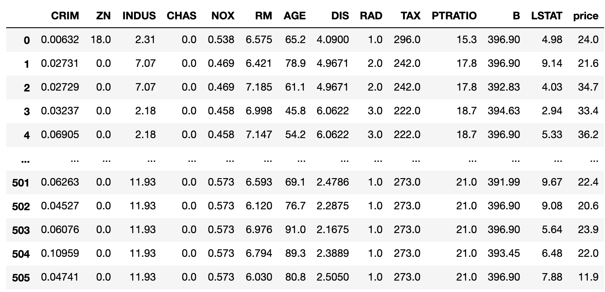

# Machine Learning学习笔记

## 常用库函数

### pandas

[pandas API文档](https://pandas.pydata.org/pandas-docs/stable/reference/index.html)

```python
# 生成DataFrame
pandas.DataFrame(data=None, index=None, columns=None, dtype=None, copy=False)

# 显示开头的部分数据
DataFrame.head(n=5)

# 输出DataFrame的总结性信息
DataFrame.info(verbose=None, buf=None, max_cols=None, memory_usage=None, null_counts=None)

# 输出数据的描述性统计信息
DataFrame.describe(percentiles=None, include=None, exclude=None, datetime_is_numeric=False)
```


### matplotlib

`matplotlib`的默认字体无法显示中文，所以需要切换字体。在`Windows`下，可以切换到`SimHei`字体；在该字体中，负号无法正常显示，所以需要加入第二行的参数设置。

```python
import matplotlib.pyplot as plt
plt.rcParams['font.sans-serif']=['SimHei'] #用来正常显示中文标签
plt.rcParams['axes.unicode_minus']=False #用来正常显示负号
```

在`Mac`下，默认并没有`SimHei`字体，我们可以切换到`Arial Unicode MS`字体，同样可以显示中文：

```python
import matplotlib.pyplot as plt
plt.rcParams['font.sans-serif'] = ['Arial Unicode MS']
```


```python
# 散点图
# s:size c:color
matplotlib.pyplot.scatter(x, y, s=None, c=None, marker=None, cmap=None, norm=None, vmin=None, vmax=None, alpha=None, linewidths=None, verts=<deprecated parameter>, edgecolors=None, *, plotnonfinite=False, data=None, **kwargs)[source]

# 标题
matplotlib.pyplot.title(label, fontdict=None, loc=None, pad=None, *, y=None, **kwargs)

# x轴标签
matplotlib.pyplot.xlabel(xlabel, fontdict=None, labelpad=None, *, loc=None, **kwargs)[source]

# y轴标签
matplotlib.pyplot.ylabel(ylabel, fontdict=None, labelpad=None, *, loc=None, **kwargs)[source]

# 显示所有的figure
matplotlib.pyplot.show(*, block=None)
```


## LinearRegression

线性回归在`sklearn`的`linear_model`模块中，可以在头部导入：

```python
from sklearn.linear_model import LinearRegression
```

此外，还要导入一些工具库：

```python
import numpy as np
import matplotlib
import matplotlib.pyplot as plt
import pandas as pd
```

在`sklearn`中有一个`datasets`模块，该模块中可以直接导入很多常用的数据集，这里我们使用波士顿房价的数据集：

```python
from sklearn.datasets import load_boston
```

下面就开始导入数据：

```python
data = load_boston()
```

得到的`data`是一个字典，其中包括：

- `data`：自变量数据
- `target`：因变量数据
- `feature_names`：每一个自变量的名字
- `DESCR`：该数据集的描述信息
- `filename`：数据集在本地的存储位置

为了方便操作数据，可以将数据转成`pandas.DataFrame`结构：

```python
# DataFrame是一个表格的样式，第一个参数传入数据，columns是每一列数据的名字
df = pd.DataFrame(data.data,columns=data.feature_names)
# 可以直接将变量名当做索引来得到数据，若没有该索引则可以新建一个
# 下列操作可以直接将因变量-房价，放到名为price的列中
df['price'] = data.target
```

得到的`DataFrame`如下：



为了方便看自变量和因变量的关系，可以通过散点图来直观观察：

```python
# 更换能显示中文的字体
plt.rcParams['font.sans-serif'] = ['Arial Unicode MS']
# 以CRIM为x轴，price为y轴画散点图
plt.scatter(df['CRIM'], data['price'])
# 设置图的标题
plt.title('城镇人均犯罪率与-房价散点图')
# 设置x轴的标题
plt.xlabel('城镇人均犯罪率')
# 设置y轴的标题
plt.ylabel('房价')
# 显示网格
plt.grid()
# 显示图像
plt.show()
```

得到结果如下：


同样的方法，可以观察其他变量之间的关系。

模型拟合很简单：

```python
lm = LinearRegression()
# 拟合数据
lm.fit(train_X,train_Y)
```

拟合完成之后，可以查看模型的参数：

```python
# 不同特征变量的系数
lm.coef_
# 拟合模型的截距
lm.intercept_
# R squre
lm.score(X, y)
```

此外，还可以直接用该模型预测新的值：

```python
test_y = lm.predict(test_X)
```

为了更客观、更有说服力，可以将数据分成训练集和测试集：

```python
train_X,test_X,train_Y,test_Y = train_test_split(X,y,test_size=0.2)
```

此外，`sklearn`中也自带交叉验证的方法：

```python
kf = KFold(n_splits=5, shuffle=True)
scores = cross_val_score(linear_model, X, y, cv=kf)
```

`scores`中有`n_splits`个元素，即`n_splits`次`KFold`得到的$R^2$。