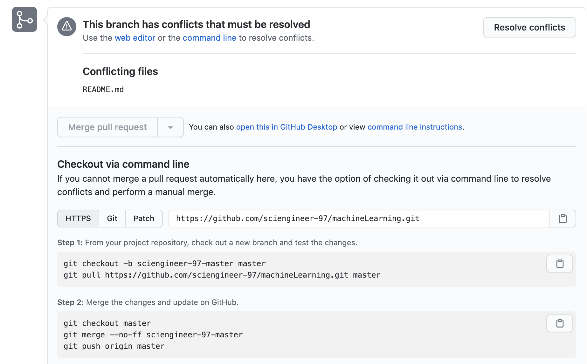
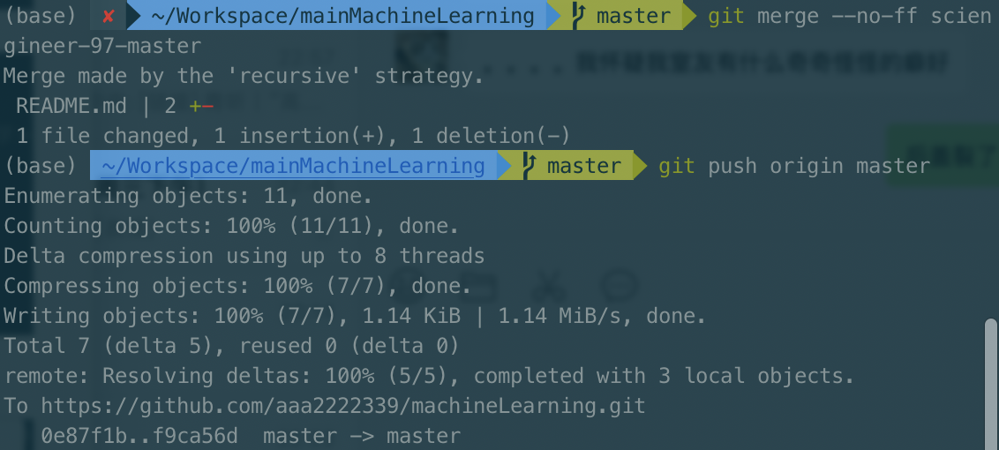

# Git 使用简单教程

## 基础操作

暂略

## PR相关操作

*内容总结自暑期特训营*

### 提交一个简单的PR

**1、fork别人的仓库**：不可能直接在别人的代码仓库中直接修改代码，你也没有这个权限，因此你可以fork一份（相当于单独复制一个分叉出来）到你自己名下的一个仓库中。

点击完`fork`按钮之后，在自己的仓库中就可以看到一个一模一样的项目了。

**2、将代码clone到本地**：代码通常是在开发者本地修改和调试的不可能直接在远程的仓库上开发，因此需要将你fork的代码下载到本地。这里的术语是clone（复制一份）到本地。

**3、修改代码**：在本地可以修改你的代码

**4、提交代码到你自己的仓库**：将修改好的代码先提交到你自己的仓库中

**5、提交PR**：在你自己的仓库中，将改动的那部分内容，向原项目仓库中提交一个请求（PR），申请将这部分改动合并到主仓库中

## 提交PR时，原始仓库已经更新过了怎么办？

待更新..

## 接受PR时出现冲突咋办？

在PR界面，会提示你分支有冲突，需要解决。点击右下角的`command line instruction`，下面就会出现怎么解决冲突的提示：

上述指令都是要在仓库的文件夹里执行，执行结果如下：

可以看到，在`pull`的时候就失败了，看最下面的提示

> Merge conflict in README.md

在`README.md`中有冲突出现。因此，需要打开`READMD.md`文件解决冲突。

其中的`<<<<<<<`，`=======`，`>>>>>>>`用来分割两个不同版本的冲突部分，这三行直接删除就行，然后把剩下的部分适当调整修改。

解决完冲突之后，就可以将内容再次提交：

回到PR界面可以看到，PR已经被`Merged`了。

